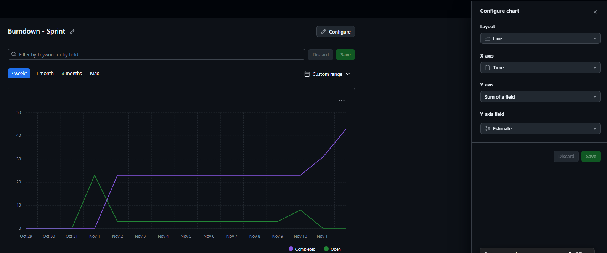
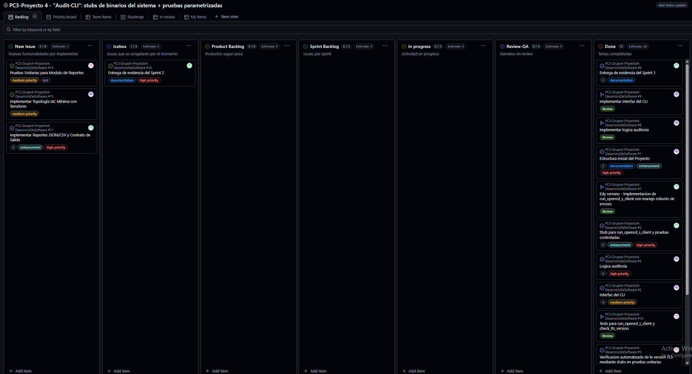
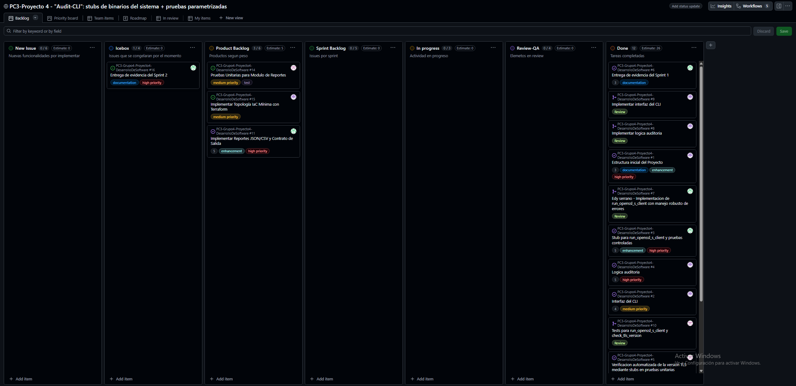
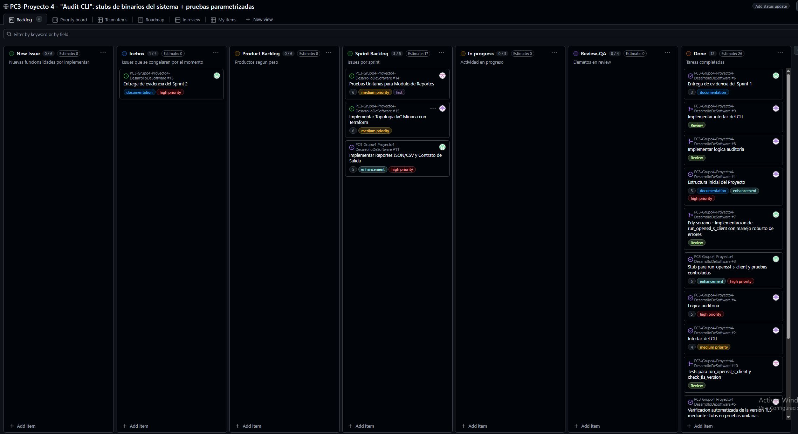
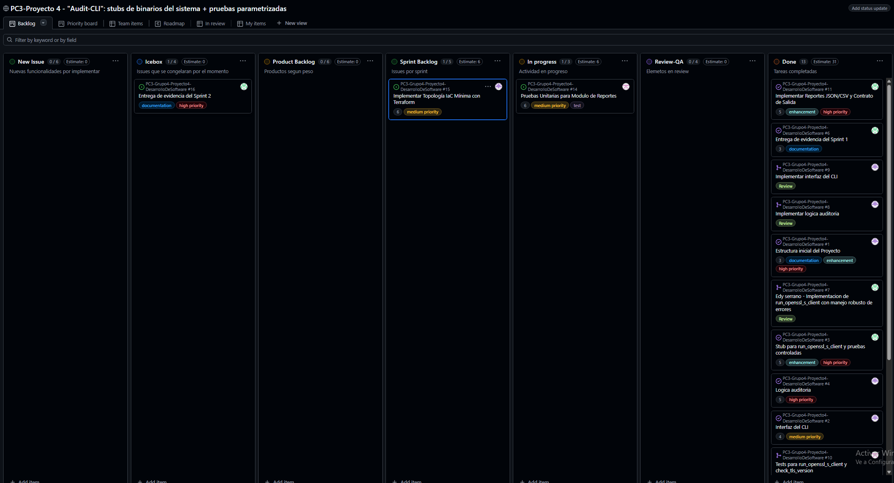
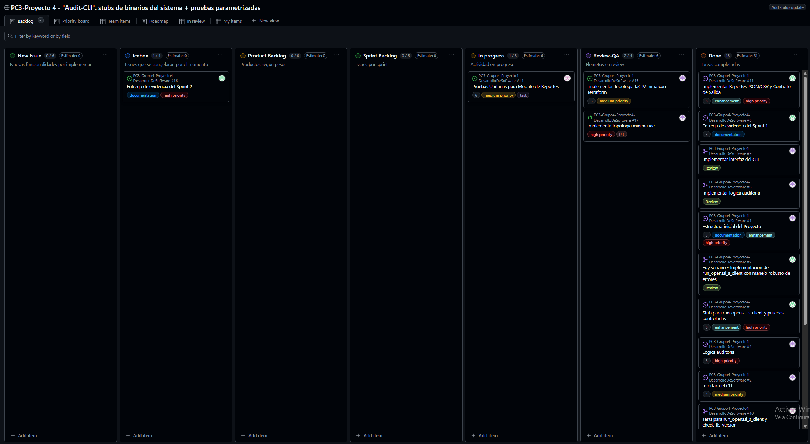
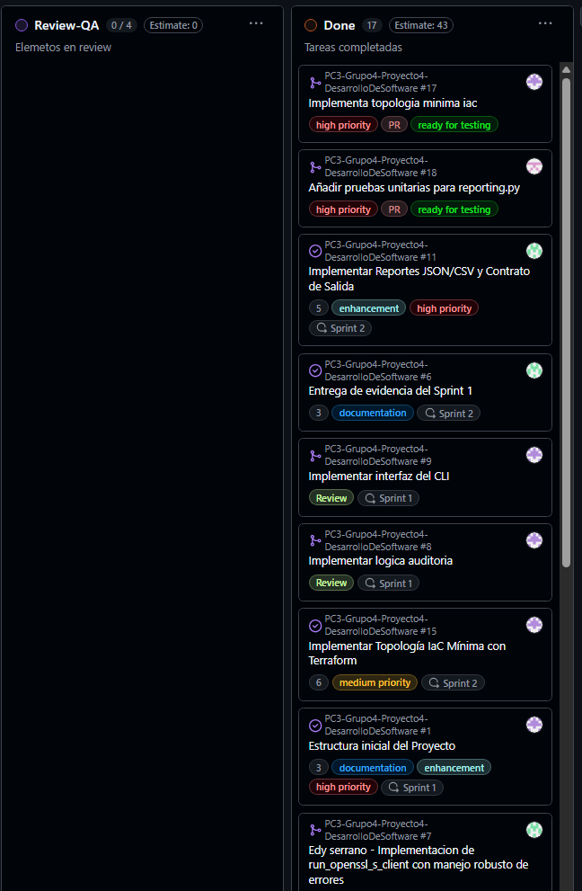
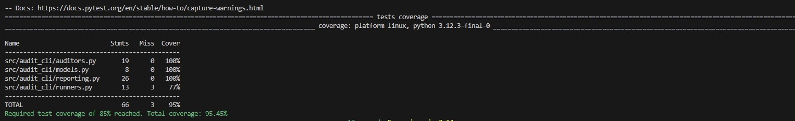

# Tablero Sprint 2:
En el grafico podemos registrar los avances y issues Open (abiertos) y Done (Terminadas)

Primero Creamos las issues con las funcionalidades que va requerir nuestro proyecto hasta el momento

**Tablero con issues**

Luego movemos a **Product backlog** para asignar los pesos de los issues que necesitaremos completar y los que no, los congelaremos y colocaremos en el **Icebox** para implementarlas mas adelante.

Luego segun el peso y referente al Sprint 2 colocamos en Sprint Backlog para poder asignar a los integrantes las tareas:

Luego de ser asignadas se ponen en la columa **In Progress**:

Una vez terminada y estar en revicion la funcionalidad implementada, mover el issue a **Review/QA** y asignarse la siguiente tarea para asi cumplir y seguir una cultura DevOps.

Finalmente despues de generar un Pull Request y revisar la funcionalidad, si cumple los criterios de aceptacion se procede a realizar el merge y se mueve a la columna **Done**, sino se rechaza el Pull Request a la rama Develop.

# Evidencia de Covertura:

No solo se verifico que los Test pasen, sino que cumple con la covertura del 85% del codigo, cvalidando asi un gate de covertura.

