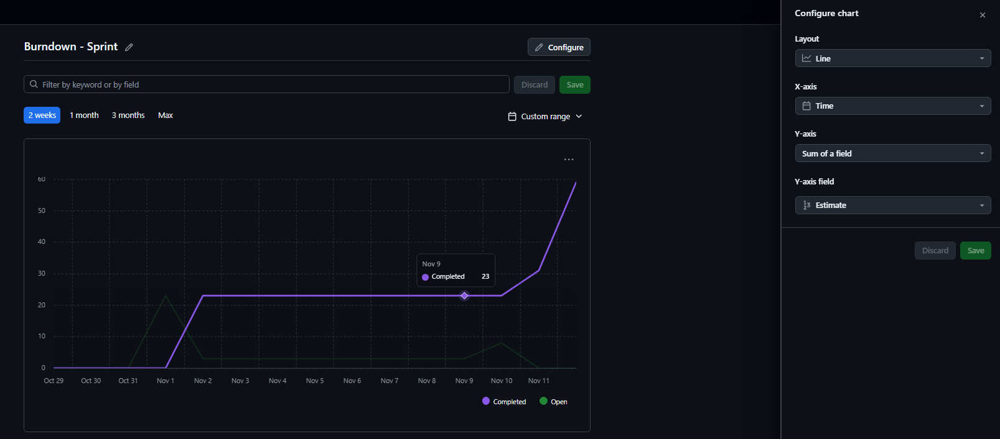
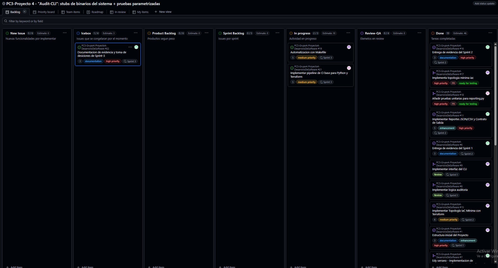
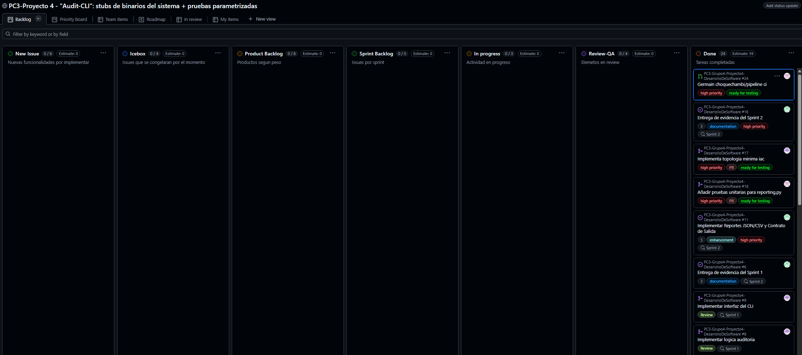
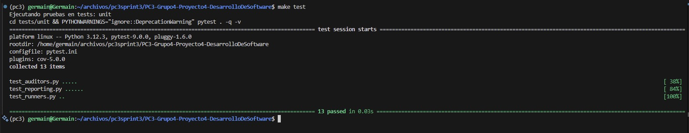
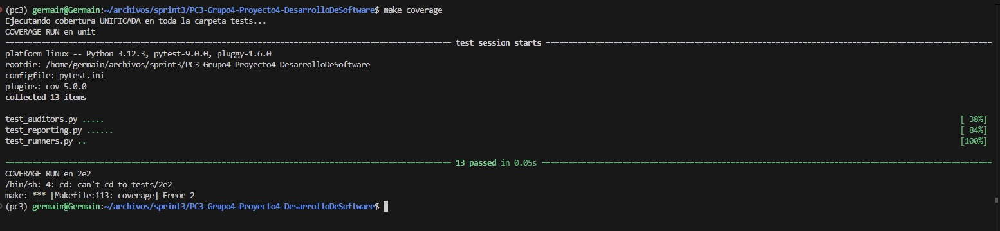
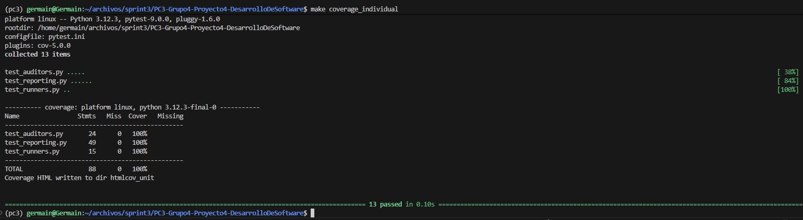
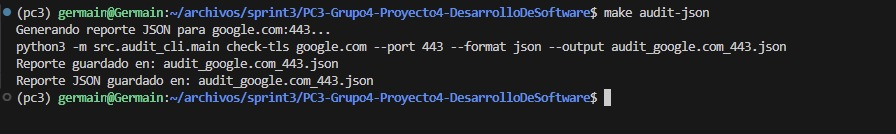

# Tablero Sprint 3:
En el grafico podemos registrar los avances y issues Open (abiertos) y Done (Terminadas)

**Tablero con issues**

Seguimos el mismo procedimiento de los anteriores Sprints sobre estimar el peso de cada issue y asignar a cada integrante del equipo:

Despues de acabar con la implementacion de cada issue, damos por terminada el Sprint:

# Evidencia de con Makefile:

Mostramos la evidancia de ejecutar los comandos del makefile:

**make test:**

**make coverage:**

**make coverage_individual:**

**make audit-json:**

Se corrobora que todos los comandos se ejecutaron correctamente, mostrando la informacion solicitada.